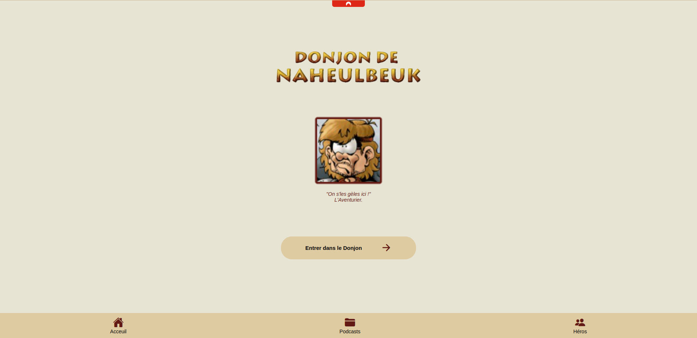
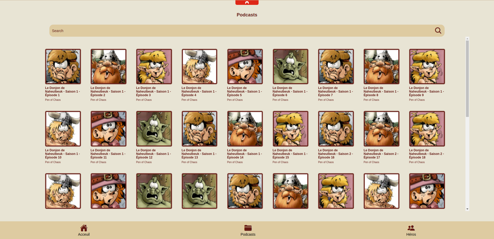
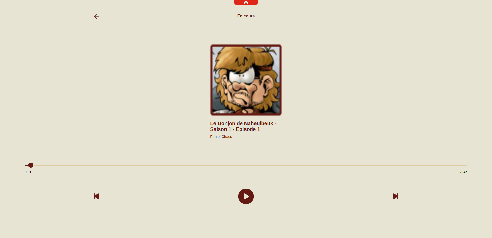
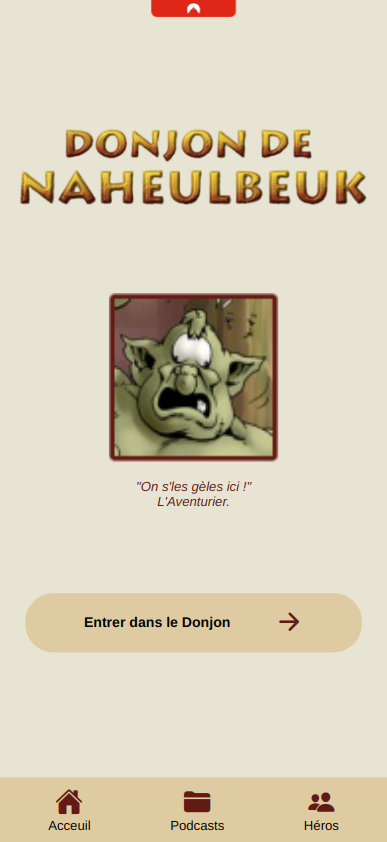
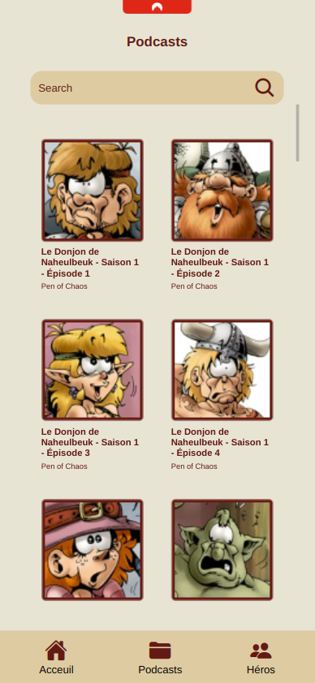
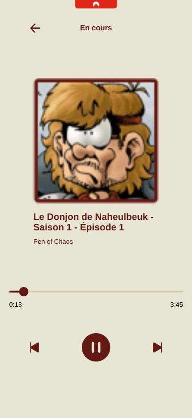
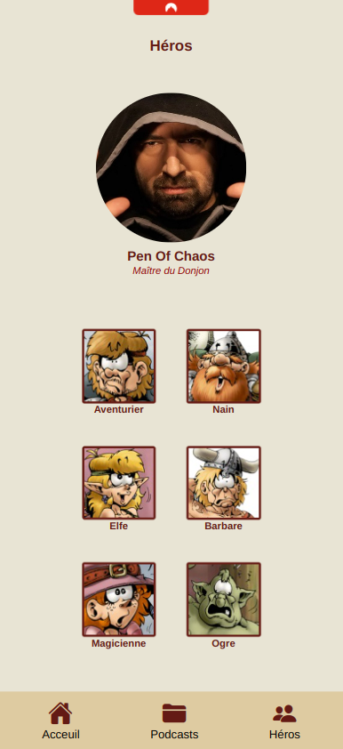

# Le Donjon de Naheulbeuk

A simple app in which we can listen an download "Le Donjon de Naheulbeuk" without internet connection.

What you can found in this app :
- Season 1
- Season 2
- Season 3

## How to launch the project : 

This project can be launched using ExpoGo or using your navigator at https://localhost:8081

```
git clone git@github.com:DonatNathan/donjon-de-naheulbeuk-app.git
cd donjon-de-naheulbeuk-app/naheulbeuk-dungeon/
npm i
npx expo start
```

Then, scan the QR code and try the app ! 

## Images : 










## Other links : 

https://donjon-de-naheulbeuk-app.pages.dev/
